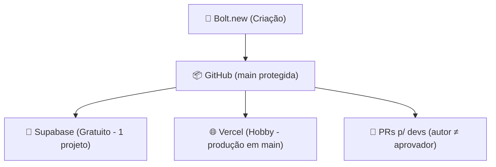

# 🧱 EGSS — Bolt Fluxo Gratuito SVC

📘 **Versão:** 1.0 📅 **Data:** 27/10/2025  
🏢 **Organização:** EG Smart Solutions 👥 **Equipe:** EGSS Desenvolvimento  

---

## 🎯 Objetivo

Este repositório centraliza os **prompts oficiais EGSS** para o **Fluxo Gratuito (single-branch)** no **Bolt.new** e descreve o **ciclo completo de funcionamento**, garantindo:

- Padrão de nomeação `{produto}-{componente}[-tipo]-gratuito`;
- Fluxo **single-branch** (`main`);
- **Apenas o Bolt** pode commitar direto na `main`;
- **Devs** só alteram via **Pull Request** e **quem cria não aprova**;
- Deploy opcional com **Supabase Gratuito** e **Vercel Hobby**.

---

# ⚙️ 1️⃣ Prompts Oficiais — EGSS Fluxo Gratuito

Cada prompt abaixo é usado em um momento específico do ciclo do projeto.

---

## 🧭 [PROMPT 1] Criação Inicial do Projeto (Bolt + GitHub)

📍 **Quando usar:** início do chat no [Bolt.new](https://bolt.new)

```bash
[EGSS • Criação de Projeto Padrão - Fluxo GRATUITO]
Crie o repositório no GitHub seguindo o padrão de nomeação EGSS:

{produto}-{componente}[-tipo]-gratuito

Onde:
- {produto}: nome do sistema, produto ou cliente (ex: erp, portalaluno, siteimobiliaria)
- {componente}: módulo técnico (ex: api, frontend, dashboard)
- [-tipo] (opcional): subvariação (ex: admin, public, mobile)
- o sufixo "gratuito" indica fluxo gratuito single-branch.

Regras:
- Use letras minúsculas e hífens.
- Exemplo: erp-api-gratuito | portalaluno-frontend-gratuito
- Conecte o Bolt ao GitHub.

Após criar o repositório:
1️⃣ Garanta que exista somente a branch `main` (padrão).  
2️⃣ Ative Branch Protection em `main` exigindo PR para devs e proíbindo auto-merge pelo autor.  
3️⃣ Permita que **apenas o Bolt** faça commits diretos na `main` (se a opção "Restrict who can push" estiver disponível).  
   • Caso não esteja disponível no seu plano: configure o Bolt para **abrir PRs** e auto-merge após checks passarem.  
```

---

## 🧠 [PROMPT 2] Integração com Supabase (Plano Gratuito)

📍 **Quando usar:** após o repo existir, para backend simples.

```bash
[EGSS • Integração com Supabase - Fluxo Gratuito]
Conecte este projeto ao Supabase Gratuito (um único projeto/instância).
Configure as variáveis de ambiente:

- SUPABASE_URL
- SUPABASE_KEY
- SUPABASE_PROJECT_ID
- SUPABASE_ENV=main

Regras:
- A branch `main` publica contra esse único projeto Supabase.
- Evite recursos pagos (RLS avançado, storage de alto volume, etc.).
```

---

## 🌐 [PROMPT 3] Integração com Vercel (Deploy Front-End — Hobby)

📍 **Quando usar:** para ativar deploy automático no gratuito.

```bash
[EGSS • Integração com Vercel - Fluxo Gratuito]
Conecte o repositório GitHub deste projeto à Vercel (Plano Hobby).
Configure o deploy:

- Branch `main` → Deploy de PRODUÇÃO

Regras:
- As variáveis de ambiente devem refletir o Supabase Gratuito (SUPABASE_URL, SUPABASE_KEY).
- Evite domínios pagos; use o domínio padrão da Vercel ou um domínio próprio já existente.
```

---

## 🔐 [PROMPT 4] Governança e Colaboração (GitHub)

📍 **Quando usar:** após o repositório existir, para proteção de branch.

```bash
[EGSS • Governança - Fluxo Gratuito]
Configure a Branch Protection Rules para `main`:

1️⃣ Exigir Pull Request para merges (de devs).  
2️⃣ Bloquear auto-aprovação: quem cria a PR não pode aprovar.  
3️⃣ (Opcional) Se disponível no seu plano: Restrict who can push → apenas o GitHub App do Bolt/automação.  
4️⃣ Caso essa opção não apareça: todos (inclusive o Bolt) usam PR; habilite auto-merge via checks/labels.

Objetivo:
- **Apenas o Bolt** pode commitar direto (quando a restrição por app estiver disponível).
- Demais alterações passam por PR com revisão.
```

---

## 🧾 [PROMPT 5] Publicação

📍 **Quando usar:** para publicar e fechar ciclo.

```bash
[EGSS • Publicação - Fluxo Gratuito]
Finalize a publicação:

1️⃣ Confirme que o nome segue {produto}-{componente}[-tipo]-gratuito.  
2️⃣ Faça o commit final do Bolt em `main` (ou PR + auto-merge, conforme o caso).  
3️⃣ Aguarde o deploy automático na Vercel Hobby.  
4️⃣ Valide as rotas e APIs conectadas ao Supabase Gratuito.
```

---

# 🚀 2️⃣ Ciclo Completo de Funcionamento — Fluxo GRATUITO EGSS

> Este ciclo mostra o fluxo **single-branch (main)** com governança mínima necessária para segurança.

---

## 🧭 1️⃣ Inicialização no Bolt.new

* Inicie o projeto no Bolt.new e cole o **Prompt 1**.
* O repositório é criado no GitHub com nome `{produto}-{componente}[-tipo]-gratuito`.
* Branch padrão: `main`.

---

## 🧱 2️⃣ Proteção da Branch `main`

* Ative Branch Protection exigindo PR para devs.
* Bloqueie auto-aprovação (autor não aprova).
* Apenas o Bolt pode commitar diretamente (se sua conta permitir restrição por app).

  * Caso não: todo mundo, inclusive Bolt, usa PR.

---

## 🧠 3️⃣ Integração Supabase (Gratuito)

* Conecte um único projeto Supabase.
* Configure `SUPABASE_*` no repositório (ou na Vercel).
* `main` publica nesse único backend.

---

## 🌐 4️⃣ Deploy Vercel (Hobby)

* Conecte o repo na Vercel.
* Configure deploy automático da `main`.
* Configure as variáveis `SUPABASE_*`.

---

## 🔐 5️⃣ Governança de PRs (para devs)

* Devs só alteram via PR.
* Autor não pode aprovar.
* Merge após revisão e checks.

---

## 🚀 6️⃣ Publicação

* Bolt faz commit direto na `main` (quando permitido) **ou** abre PR com auto-merge.
* Vercel publica.
* Supabase já está apontado.

---

## 📊 Fluxo Visual Simplificado



---

## 🧠 Resumo Final

| Etapa | Plataforma | Objetivo | Resultado |
| :------------- | :-------------- | :------------------------------- | :----------------- |
| 1️⃣ Criação | Bolt + GitHub | Estrutura inicial | Repo padronizado |
| 2️⃣ Proteção | GitHub | PRs + bloqueio de auto-aprovação | Segurança mínima |
| 3️⃣ Supabase | Gratuito | Backend único | Simplicidade |
| 4️⃣ Vercel | Hobby | Deploy automático | Produção básica |
| 5️⃣ Governança | GitHub | Regras de PR | Rastreabilidade |
| 6️⃣ Publicação | GitHub + Vercel | Go-live | Site/serviço ativo |
